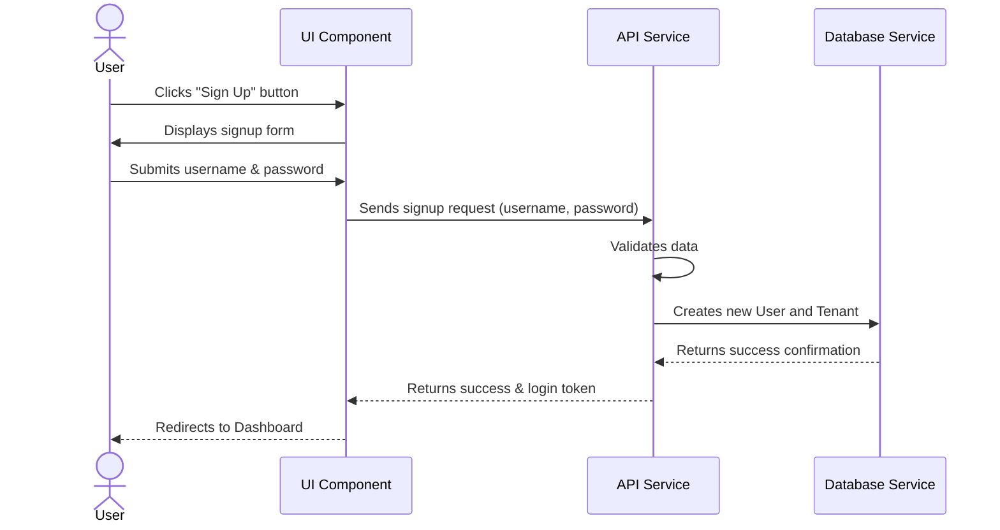
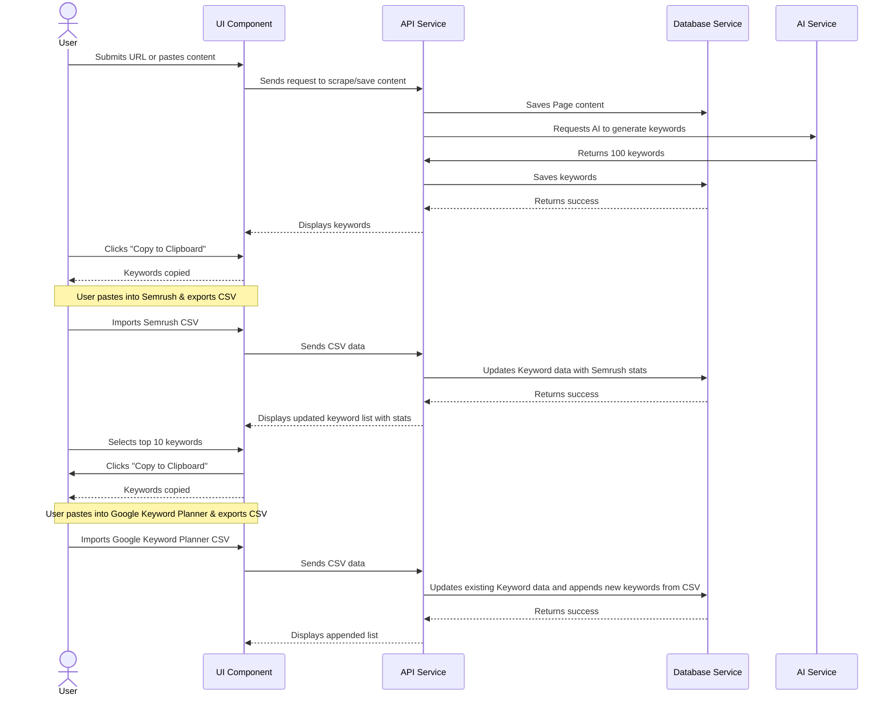

### Full-Stack Architecture Document

#### High Level Architecture

**Technical Summary**
This architecture will use a full-stack approach, combining a Node.js backend and a React frontend within a monorepo structure. This setup is ideal for a project that will have both an Electron desktop app and a web app, as it enables code sharing and consistent development across both platforms. We will be using Vercel for hosting and Neon as our database, ensuring a scalable and efficient infrastructure. This architecture is designed to support the key goals of process efficiency and data centralization as outlined in the PRD.

**Platform and Infrastructure Choice**

  * **Platform:** Vercel
  * **Key Services:** Neon (Postgres database), Vercel's Serverless Functions
  * **Deployment Host and Regions:** A single region (e.g., `us-east-1` in AWS) for the initial MVP.

**Repository Structure**

  * **Structure:** We will use a **monorepo** to house both the web application and the Electron desktop application.
  * **Monorepo Tool:** We will use a tool like **Turborepo** or **Nx** to manage the various packages and dependencies within the monorepo.
  * **Package Organization:** The monorepo will be organized into two main packages: an `apps` directory for the main applications and a `packages` directory for shared code, such as UI components and data schemas.

-----

#### Tech Stack

**Cloud Infrastructure**

  * **Provider:** Vercel
  * **Key Services:** Neon (Postgres database), Vercel's Serverless Functions
  * **Deployment Host and Regions:** Single region (e.g., `us-east-1` in AWS)

**Technology Stack Table**
| Category | Technology | Version | Purpose | Rationale |
| :--- | :--- | :--- | :--- | :--- |
| **Language** | TypeScript | N/A | Primary development language | Strong typing, excellent tooling, and team expertise |
| **Frontend Framework** | React | N/A | Front-end framework | Enterprise-ready, component-based, and widely supported |
| **Styling** | Tailwind CSS | N/A | CSS framework | Utility-first approach for rapid and consistent styling |
| **Backend Framework** | Node.js | N/A | Backend framework | Asynchronous, scalable, and a unified language with the frontend |
| **Data Schemas** | Zod | N/A | Validation library | Provides a clear and efficient way to validate data on both the frontend and backend |
| **ORM** | Prisma | N/A | Object-Relational Mapper | Type-safe database access and streamlined schema management |
| **Database** | Neon | N/A | Serverless PostgreSQL | Aligns with Vercel's serverless architecture, providing a scalable and cost-effective solution |
| **Testing** | Playwright | N/A | E2E testing framework | Provides end-to-end testing, ensuring the application is robust and reliable |
| **Version Control** | GitHub | N/A | Version control | Standard for code collaboration and versioning |
| **Hosting** | Vercel | N/A | Hosting provider | Provides a seamless hosting experience for Next.js applications with built-in serverless functions |

-----

#### Data Models

  * **User**: This entity represents a single user in the system. It will contain a username, password, and be linked to a specific tenant.
  * **Tenant**: This entity represents a team or client. It will be the central container for all users, projects, and AI API keys. The system will be designed to handle an unknown number of AI API keys, which will be securely stored against this tenant entity.
  * **Project**: This entity represents a keyword research project. It will be linked to a tenant and an associated domain. It will contain all the keyword research data and named lists for a specific web page.
  * **AI Prompt**: This new entity will store the customizable prompt text and the selected AI model to be used for keyword generation. It will be linked to a specific tenant for shared use by a team.
  * **Keyword List**: This entity represents a named list of keywords within a project.
  * **Keyword**: This entity represents a single keyword and its associated stats (e.g., search volume, difficulty) from external tools. It will be linked to a keyword list.
  * **Page**: This entity represents a single web page that is being optimized within a project. It will be linked to a project and will contain the final keyword, titles, and descriptions.
  * **SEO Items**: This new entity will store the generated article titles, meta titles, and meta descriptions. It will be linked to a specific page and will also contain the selected favorites and the final choice.
  * **Invitation**: This new entity will manage access for clients. It will store which pages a user has been granted access to and will be linked to a specific user and a project.

-----

#### Components

Based on the architectural patterns and tech stack, the application will be composed of the following major logical components:

  * **UI Component**: This is the React frontend. Its primary responsibility is all user-facing interactions, including the display of data, the user journey, and handling user input.
  * **API Service**: This is the Node.js backend. It will be the central hub for all business logic, data validation, and communication with the database.
  * **Database Service**: This is the Neon database. It's solely responsible for data persistence, storage, and retrieval.
  * **AI Service**: This service will handle all interactions with the user-provided AI models for generating keywords and other SEO elements.
  * **Data Scraper Service**: This service will be responsible for securely scraping and ingesting content from a given URL.

-----

#### Core Workflows

**Onboarding & Project Creation**



**Keyword Research Workflow**



-----

#### REST API Spec

```yaml
openapi: 3.0.0
info:
  title: Multi-Stage Keyword Optimization Tool API
  version: 1.0.0
  description: API for managing keyword research projects, users, and data.
servers:
  - url: /api/v1
    description: Production server
paths:
  /tenants:
    post:
      summary: Create a new tenant
      requestBody:
        required: true
        content:
          application/json:
            schema:
              type: object
              properties:
                name:
                  type: string
      responses:
        '201':
          description: Tenant created successfully
  /projects:
    post:
      summary: Create a new project
      requestBody:
        required: true
        content:
          application/json:
            schema:
              type: object
              properties:
                name:
                  type: string
                domain:
                  type: string
      responses:
        '201':
          description: Project created successfully
```

-----

#### Database Schema

```sql
CREATE TABLE tenants (
    id UUID PRIMARY KEY,
    name VARCHAR(255) NOT NULL,
    ai_api_keys JSONB -- Stores multiple AI API keys as a JSON object
);

CREATE TABLE users (
    id UUID PRIMARY KEY,
    username VARCHAR(255) NOT NULL UNIQUE,
    password_hash VARCHAR(255) NOT NULL,
    tenant_id UUID REFERENCES tenants(id)
);

CREATE TABLE projects (
    id UUID PRIMARY KEY,
    name VARCHAR(255) NOT NULL,
    domain VARCHAR(255),
    tenant_id UUID REFERENCES tenants(id),
    UNIQUE (name, tenant_id)
);
```

-----

#### Source Tree

```text
my-keyword-tool/
├── apps/
│   ├── web/                    # The React web application
│   └── desktop/                # The Electron desktop application
├── packages/
│   ├── ui/                     # Shared UI components (React)
│   ├── api-client/             # Shared API client logic
│   └── types/                  # Shared TypeScript interfaces (e.g., data models)
├── docs/                       # Project documentation (PRD, UI/UX Spec, Architecture)
├── .gitignore
├── package.json
└── README.md
```

-----

#### Infrastructure and Deployment

  * **Infrastructure as Code (IaC)**: We'll take an IaC approach for all infrastructure resources, ensuring our environments are consistent and easily reproducible. This will be crucial for managing our Vercel and Neon configurations.
  * **Deployment Strategy**: The primary strategy will be automated deployment via a CI/CD pipeline triggered by commits to the main branch on GitHub. Vercel's native integration with GitHub is ideal for this, as it handles the build and deployment processes automatically.
  * **Environments**: We will establish the following environments to support our development workflow:
      * **Development**: A local environment for day-to-day development and testing.
      * **Staging**: A pre-production environment where we can test features before they go live.
      * **Production**: Our live environment for the public-facing application.
  * **Rollback Strategy**: In the event of a critical issue, our rollback strategy will be to revert to the previous successful commit on GitHub. Vercel's platform makes this process straightforward, as it keeps a history of all deployments.

-----

#### Error Handling Strategy

  * **General Approach**: The system will use a standardized error model across the entire application. All API error responses will follow a consistent format (e.g., a JSON object with a `code` and `message`). This ensures that the frontend can handle errors gracefully and consistently.
  * **Logging Standards**: We'll implement a centralized logging strategy using a Node.js library to capture and log errors, warnings, and other system events. We will define clear logging levels (e.g., `info`, `warn`, `error`) to ensure that we can quickly identify and troubleshoot issues.
  * **Frontend Error Handling**: The frontend will be designed to handle API errors gracefully. Instead of displaying raw error messages, it will present user-friendly messages and guide the user to a solution or a support channel.
  * **Backend Error Handling**: The backend will use middleware to centralize all error handling. This will ensure that all errors, including validation errors, database errors, and uncaught exceptions, are caught, logged, and returned to the frontend in a consistent format.
  * **Security**: We will ensure that no sensitive information (e.g., API keys, user data, server logs) is exposed in error messages.

-----

#### Coding Standards

  * **Development Workflow**: Each story will be developed on its own dedicated branch. This ensures that changes for a single story are isolated and do not conflict with other work.
  * **Version Control**: Developers must commit their work regularly. The IDs of these commits must be noted in the story document. This provides a clear, auditable trail of all changes made during the development of each story.
  * **Definition of Done**: A story is only considered complete when all of the following conditions are met:
      * The system successfully builds without errors.
      * There are no linting or TypeScript errors.
      * All tests pass.
  * **File Naming and Documentation**: All filenames that are added or changed during the development of a story must be listed in the story's documentation. This provides a clear record of the files that were affected and makes it easier to review and track changes.

-----

#### Test Strategy

  * **Testing Philosophy**: We will employ a testing pyramid approach with a focus on writing a high number of fast, reliable unit tests and a smaller number of end-to-end tests.
  * **Unit Tests**: We will write unit tests to test individual functions and components in isolation. This is where we'll ensure that our business logic, data validation, and UI components work as expected.
  * **Integration Tests**: Integration tests will be used to ensure that different parts of our system, such as the API and the database, work together seamlessly.
  * **End-to-End (E2E) Tests**: We will use **Playwright** to perform end-to-end testing, simulating real user scenarios to ensure that the entire application works as expected. These tests will cover critical user journeys like account creation, project management, and the full keyword research workflow.
  * **Test Data Management**: We will implement a clear strategy for managing test data, ensuring our tests are repeatable and reliable. This will be crucial for a multi-tenant application where data integrity is paramount.

-----

#### Security

  * **Authentication & Authorization**: We will implement a robust authentication mechanism to verify user identity. We will also define an authorization model to ensure that users can only access data and features they are authorized to use.
  * **Data Security**: We will protect all data in transit using HTTPS and data at rest using encryption. We will define strict rules for handling sensitive data, such as AI API keys and user credentials, to prevent unauthorized access.
  * **API & Service Security**: We will implement security controls at the API level, including input validation and rate limiting. This will protect our API from common attacks, such as SQL injection and brute-force attacks.
  * **Infrastructure Security**: We will define network security rules, such as firewalls and security groups, to protect our application's infrastructure. We will also follow the principle of least privilege, ensuring that our services only have access to the resources they need.
  * **Dependency Security**: We will use a dependency scanning tool to identify and address any known vulnerabilities in our third-party libraries. This is a crucial step in protecting our application from supply-chain attacks.

-----
