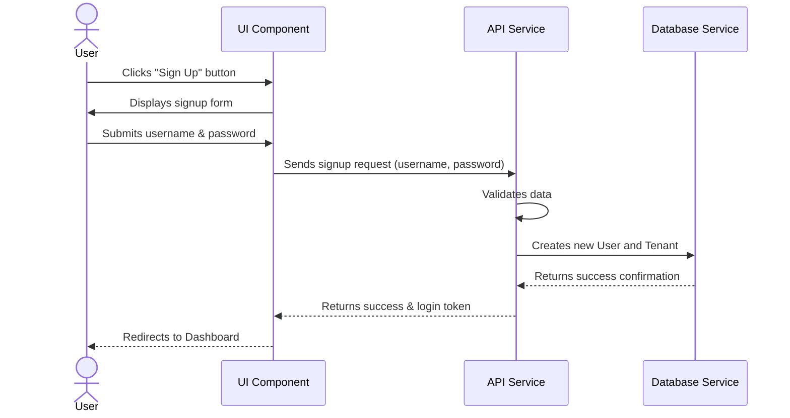
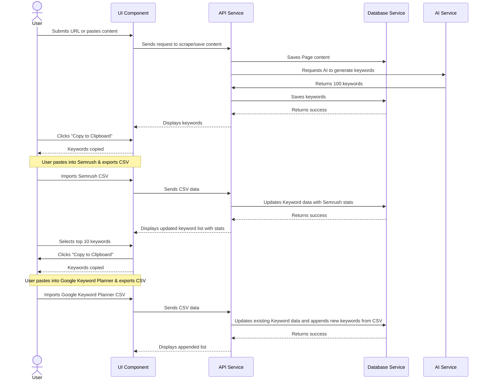

# Core Workflows

**Onboarding & Project Creation**

```mermaid
sequenceDiagram
    actor User
    participant App as UI Component
    participant API as API Service
    participant DB as Database Service
    
    User->>App: Clicks "Sign Up" button
    App->>User: Displays signup form
    User->>App: Submits username & password
    App->>API: Sends signup request (username, password)
    API->>API: Validates data
    API->>DB: Creates new User and Tenant
    DB-->>API: Returns success confirmation
    API-->>App: Returns success & login token
    App-->>User: Redirects to Dashboard
```

**Keyword Research Workflow**

```mermaid
sequenceDiagram
    actor User
    participant App as UI Component
    participant API as API Service
    participant DB as Database Service
    participant AI as AI Service
    
    User->>App: Submits URL or pastes content
    App->>API: Sends request to scrape/save content
    API->>DB: Saves Page content
    API->>AI: Requests AI to generate keywords
    AI->>API: Returns 100 keywords
    API->>DB: Saves keywords
    DB-->>API: Returns success
    API-->>App: Displays keywords
    
    User->>App: Clicks "Copy to Clipboard"
    App-->>User: Keywords copied
    
    Note over User, App: User pastes into Semrush & exports CSV
    
    User->>App: Imports Semrush CSV
    App->>API: Sends CSV data
    API->>DB: Updates Keyword data with Semrush stats
    DB-->>API: Returns success
    API-->>App: Displays updated keyword list with stats
    
    User->>App: Selects top 10 keywords
    App->>User: Clicks "Copy to Clipboard"
    App-->>User: Keywords copied
    
    Note over User, App: User pastes into Google Keyword Planner & exports CSV
    
    User->>App: Imports Google Keyword Planner CSV
    App->>API: Sends CSV data
    API->>DB: Updates existing Keyword data and appends new keywords from CSV
    DB-->>API: Returns success
    API-->>App: Displays appended list
```